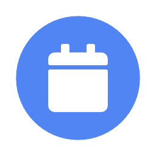

    

Google Calendar for Alfred
==========================

View Google Calendar events in [Alfred][alfred].

<!-- MarkdownTOC autolink="true" bracket="round" depth="3" autoanchor="true" -->

- [Download & installation](#download--installation)
- [Usage](#usage)
    - [Date format](#date-format)
- [Configuration](#configuration)
- [Licensing & thanks](#licensing--thanks)

<!-- /MarkdownTOC -->

Download & installation
-----------------------

Grab the workflow from [GitHub releases][download]. Download the `Google-Calendar-View-X.X.alfredworkflow` file and double-click it to install.

Usage
-----

When run, the workflow will open Google Calendar in your browser and ask for permission to read your calendars. If you do not grant permission, it won't work.

You will also be prompted to activate some calendars (the workflow will show events from these calendars).

- `gcal` — Show upcoming events.
    - `<query>` — Filter list of events.
    - `↩` — Open event in browser or day in workflow.
    - `⌘↩` — Open event in Google or Apple Maps (if event has a location).
    - `⇧` / `⌘Y` — Quicklook event details.
- `today` / `tomorrow` / `yesterday` — Show events for the given day.
    - `<query>` / `↩` / `⌘↩` / `⇧` / `⌘Y` — As above.
- `gdate [<date>]` — Show one or more dates. See below for query format.
    - `↩` — Show events for the given day.
- `gcalconf [<query>]` — Show workflow configuration.
    - `Active Calendars` — Turn calendars on/off.
        - `↩` — Toggle calendar on/off.
    - `Workflow is up to Date` / `An Update is Available` — Whether a newer version of the workflow is available.
        - `↩` — Check for or install update.
    - `Open Documentation` — Open this page in your brower.
    - `Get Help` — Visit [the thread for this workflow][forumthread] on [AlfredForum.com][alfredforum].
    - `Report Issue` — [Open an issue][issues] on GitHub.
    - `Clear Cached Calendars & Events` — Remove cached data.

### Date format ###

The keyword `gdate` supports an optional date. This can be specified in a number of format:

- `YYYY-MM-DD` — e.g. `2017-12-01`
- `YYYYMMDD` — e.g. `20180101`
- `[+|-]N[d|w]` — e.g.:
    - `1`, `1d` or `+1d` for tomorrow
    - `-1` or `-1d` for yesterday
    - `3w` for 21 days from now
    - `-4w` for 4 weeks ago

Configuration
-------------

There are a couple of options in the workflow's configuration sheet (the `[x]` button in Alfred Preferences):

|      Setting       |                                                 Description                                                 |
|--------------------|-------------------------------------------------------------------------------------------------------------|
| `APPLE_MAPS`       | Set to `1` to open map links in Apple Maps instead of Google Maps.                                          |
| `CALENDAR_APP`     | Name of application to open Google Calendar URLs (not map URLs) in. If blank, your default browser is used. |
| `EVENT_CACHE_MINS` | Number of minutes to cache event lists before updating from the server.                                     |
| `SCHEDULE_DAYS`    | The number of days' events to show with the `gcal` keyword.                                                 |

Licensing & thanks
------------------

This workflow is released under the [MIT Licence][mit].

It is heavily based on the [Google API libraries for Go][google-libs] ([BSD 3-clause licence][google-licence]) and [AwGo][awgo] libraries ([MIT][mit]), and of course, [Google Calendar][gcal].

The icons are from [Elusive Icons][elusive], [Font Awesome][awesome], [Material Icons][material], [Weather Icons][weather] (all [SIL][sil]) and [Octicons][octicons] ([MIT][mit]), via the [workflow icon generator][icongen].

[gcal]: https://calendar.google.com/calendar/
[google-libs]: https://github.com/google/google-api-go-client
[google-licence]: https://github.com/google/google-api-go-client/blob/master/LICENSE
[alfred]: https://alfredapp.com/
[alfredforum]: https://www.alfredforum.com/
[awgo]: https://github.com/deanishe/awgo
[forumthread]: https://www.alfredforum.com/topic/11016-google-calendar-view/
[download]: https://github.com/deanishe/alfred-gcal/releases/latest
[issues]: https://github.com/deanishe/alfred-gcal/issues
[sil]: http://scripts.sil.org/cms/scripts/page.php?site_id=nrsi&id=OFL
[mit]: https://opensource.org/licenses/MIT
[elusive]: https://github.com/aristath/elusive-iconfont
[awesome]: http://fortawesome.github.io/Font-Awesome/
[material]: http://zavoloklom.github.io/material-design-iconic-font/
[octicons]: https://octicons.github.com/
[weather]: https://erikflowers.github.io/weather-icons/
[icongen]: http://icons.deanishe.net
